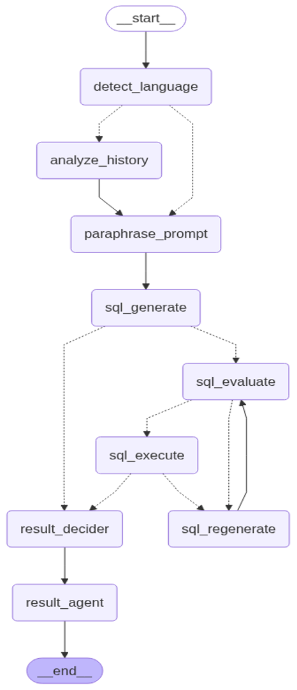

# Query-Quant  

Query-Quant is an AI-powered data query and visualization tool. It allows users to upload CSV/XLSX/XLS files, ask natural language questions about the data, and get instant insights in the form of text, tables, and charts.  

The system integrates **LangChain**, **LangGraph**, **FastAPI**, **Streamlit**, and **Docker** to connect natural language queries with structured data for seamless analysis.  

---

## 🚀 Features  

- 📂 **Upload Excel/CSV files** directly from the UI.  
- 🤖 **Natural language queries** powered by LLMs.  
- 📊 **Dynamic visualizations** — auto-generate bar charts, scatter plots, and tables.  
- 💬 **Conversational interface** with chat history.  
- 🐳 **Dockerized setup** for easy deployment.  
- ⚡ **Backend (FastAPI)** for prompt processing and LLM orchestration.  
- 🎨 **Frontend (Streamlit)** for interactive user experience.  

---

## 🛠️ Tech Stack  

- **Backend:** FastAPI, Python  
- **Frontend:** Streamlit  
- **AI Frameworks:** LangChain, LangGraph  
- **Containerization:** Docker & Docker Compose  
- **Other:** Pandas, Matplotlib, OpenAI API  

---

## 📂 Project Structure  

```
query-quant/
│── backend/              # FastAPI backend (prompt handling, SQL execution, LLM calls)
│── frontend/             # Streamlit UI
│── main.py               # Entry point for app orchestration
│── docker-compose.yml    # Docker multi-service configuration
│── .gitignore
└── .dockerignore
```

---

## ⚙️ Installation & Setup  

### Prerequisites  
- Python 3.10+  
- Docker & Docker Compose  
- OpenAI API key (or other LLM provider key)  

### 🐳 Option 1: Run with Docker (Recommended) 

```bash
docker compose up --build
```


###  💻 Option 2: Run Locally 

```bash
# Clone repo
git clone https://github.com/your-username/Query-Quant.git
cd Query-Quant/query-quant

# Backend setup
cd backend
pip install -r requirements.txt

# Frontend setup
cd ../frontend
pip install -r requirements.txt
```

Run backend:  
```bash
cd backend
uvicorn main:app --reload --host 0.0.0.0 --port 8000
```

Run frontend:  
```bash
cd frontend
streamlit run app.py
```


---

## 🔑 Environment Variables  

Create a `.env` file in the project root with:  

```env
OPENAI_API_KEY=your_openai_api_key
BACKEND_URL=http://localhost:8000
```

---

## 🖥️ Usage  

1. Open the Streamlit UI in your browser.  
2. Upload a CSV/XLSX file.  
3. Ask a question in natural language (e.g., *"Show a bar chart of total Quantity by Stock Symbol"*)  
4. View results as **text, tables, or charts**.  

---

## 🧩 LangGraph Workflow  



---

## 📸 Demo  


---


## 📜 License  

MIT License.  
